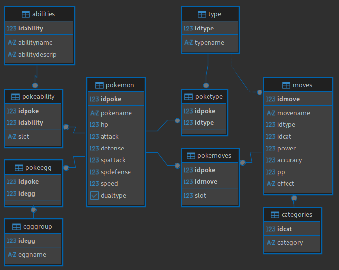

# Esquema SQL 2C25

Este repositorio contiene el script de docker compose y el script inicial para poblar la base de datos PostgreSQL. Se adjunta un diagrama de las tablas del schema:

ATENCIÓN: La idea original de este esquema es de Ignacio Suárez Andrés, y podemos encontrar el trabajo original en [este link](https://github.com/nachosandres/database).

## Conetarse a la Base de Datos

Para poder conectarse a la bdd primero se debe levantar esta misma con el comando `docker compose up -d`. Luego para poder conectarnos `psql -h localhost -p 5432 -U admin -d postgres`

## Correr archivos `.sql`

`\i path-to-file/file.sql` . El path del archivo no es el relativo desde levantaron la bdd, sino que tiene que ser el path literal del archivo .sql. Como ejemplo `\i /home/MyUser/Documents/BDD/PokemonDB/create-schema.sql`